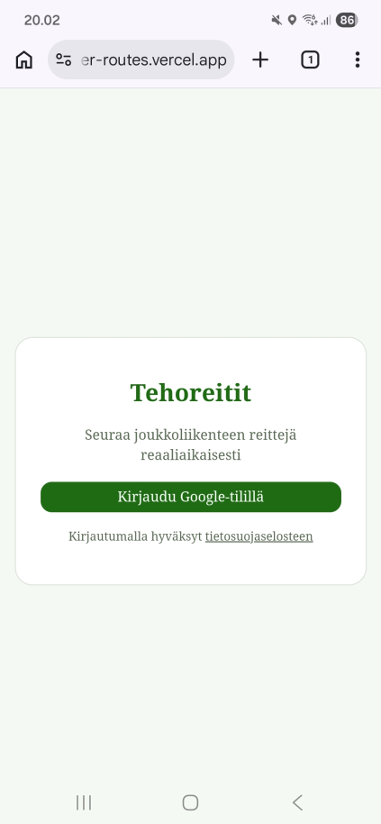
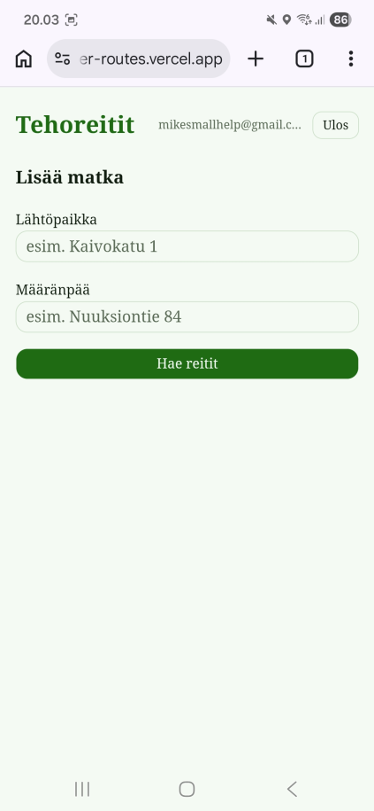
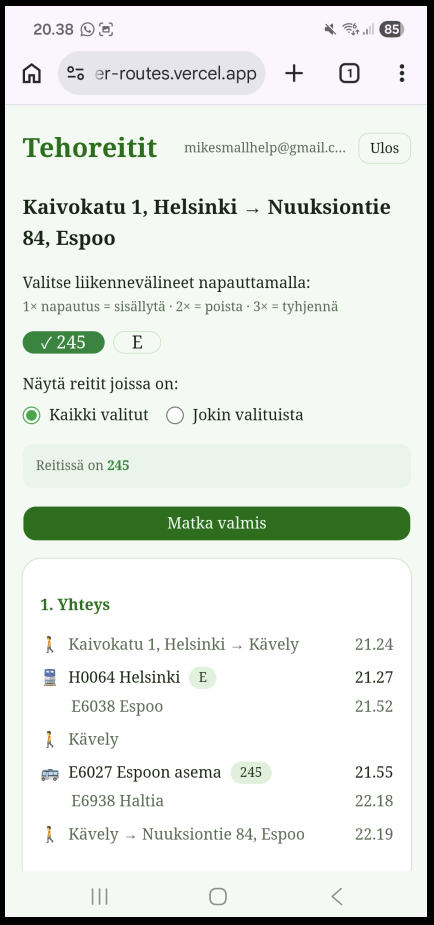
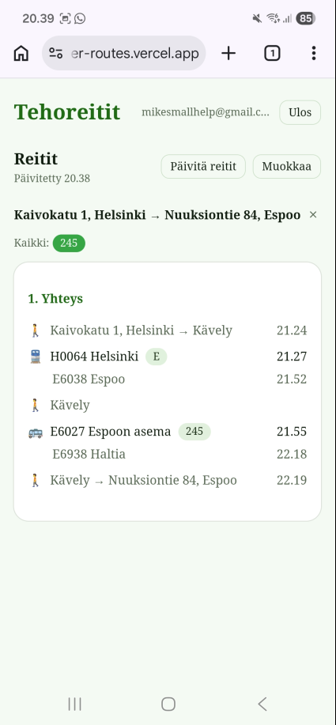
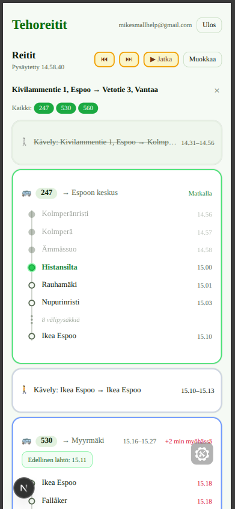

# Super Routes

A public transport route planner for the HSL area (Helsinki region). Save your favorite routes and monitor real-time connections sorted by your current location.






## Tech stack

- **Next.js 16** (App Router) + **React 19**
- **Tailwind CSS 4** + **shadcn/ui**
- **Prisma ORM** (PostgreSQL)
- **NextAuth.js** (Google OAuth)
- **Digitransit API** (routing and geocoding)
- **SWR** (real-time data fetching)

## Configuration

Create a `.env.local` file in the project root:

```env
DIGITRANSIT_API_KEY=your_api_key
PRISMA_DATABASE_URL=your_postgres_connection_string
GOOGLE_CLIENT_ID=your_google_client_id
GOOGLE_CLIENT_SECRET=your_google_client_secret
AUTH_SECRET=your_nextauth_secret
```

### Digitransit API key

1. Register at https://portal-api.digitransit.fi/
2. Copy the API key to `DIGITRANSIT_API_KEY`

### Google authentication

1. Go to [Google Cloud Console](https://console.cloud.google.com/)
2. Create a new project or select an existing one
3. Navigate to **APIs & Services** > **Credentials**
4. Create an **OAuth 2.0 Client ID** (type: Web application)
5. Add **Authorized JavaScript origins**: `http://localhost:3000` (and your production URL)
5. Add **Authorized redirect URIs**: `http://localhost:3000/api/auth/callback/google` (and your production URL)
6. Copy the Client ID and Client Secret to `.env.local`

Generate `AUTH_SECRET` with:

```bash
npx auth secret
```

### Database

Prisma requires a PostgreSQL database. You can easily create one for both development and production via the Vercel dashboard. Run migrations:

```bash
npx prisma db push
```

## Development

```bash
npm install
npm run dev
```

The app starts at http://localhost:3000.

For local development you can also enable the built-in mock journey flow with `NEXT_PUBLIC_USE_MOCK_DATA=true` in `.env.local`. This is useful for testing location-based tracking and transfer states without live Digitransit data. `NEXT_PUBLIC_MOCK_INTERVAL_MS` controls how long each mock scenario stays active before advancing automatically. The yellow buttons in the live view let you pause the mock flow and step through the journey one phase at a time.



## Production deployment

The recommended platform is **Vercel**. It has native Next.js support and handles builds, edge functions, and environment variables automatically.
